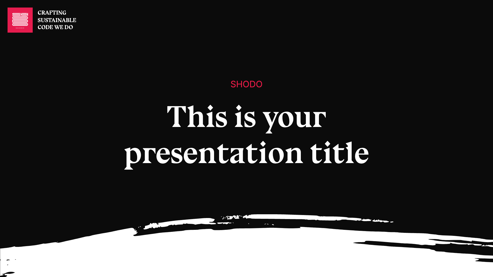
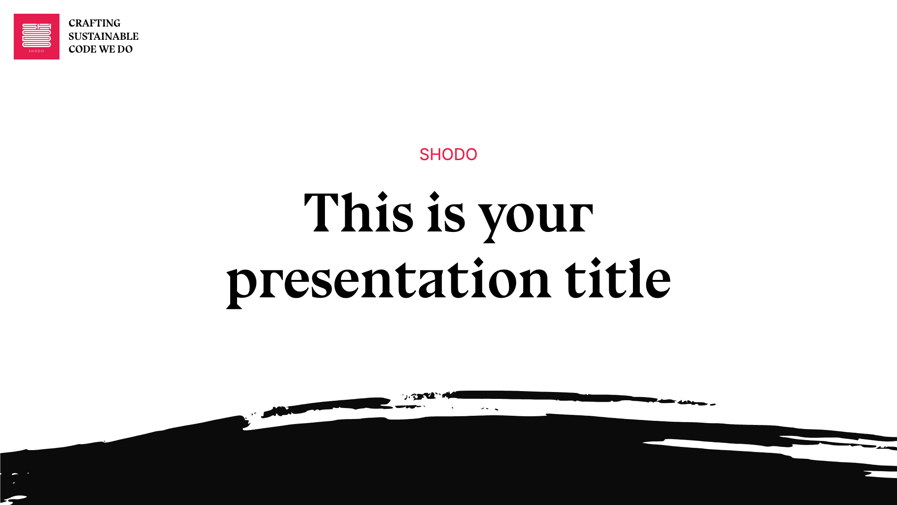

# slidev-theme-shodo

A Shodo theme for [Slidev](https://github.com/slidevjs/slidev).

run `npm run dev` to check out the example slides for more details of how to start writing a presentation

Live demo: [https://shodo-nantes.github.io/slidev-theme-shodo](https://shodo-nantes.github.io/slidev-theme-shodo)

|                Dark                 |                Light                 |
| :---------------------------------: | :----------------------------------: |
|  |  |

<!-- ## Install

Add the following frontmatter to your `slides.md`. Start Slidev then it will prompt you to install the theme automatically.

<pre><code>---
theme: <b>slidev-theme-shodo</b>
---</code></pre>

Learn more about [how to use a theme](https://sli.dev/themes/use). -->

## Layouts

This theme provides the following layouts:

- center
- cover
- default
- end
- fact
- full
- iframe-left
- iframe-right
- iframe
- image-left
- image-right
- image
- intro
- none
- quote
- screenshot
- section
- six-cell-header
- statement
- three-cols-header
- three-cols
- three-rows
- two-cols-header
- two-cols

## Components

This theme provides the following components:

- big-concept
- slides-current-number
- title-number
- watermark

## Contributing

- `npm install`
- `npm run dev` to start theme preview of `example.md`
- Edit the `example.md` and style to see the changes
- `npm run format` to format the code and fix lint errors
- `npm run export` to generate the preview PDF
- `npm run screenshot` to generate the preview PNG
