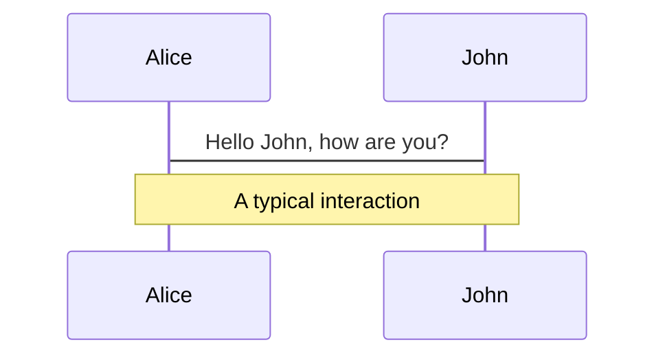
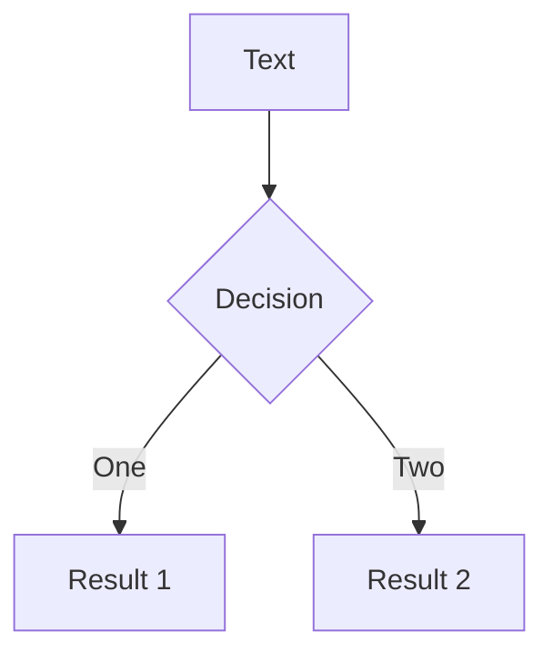
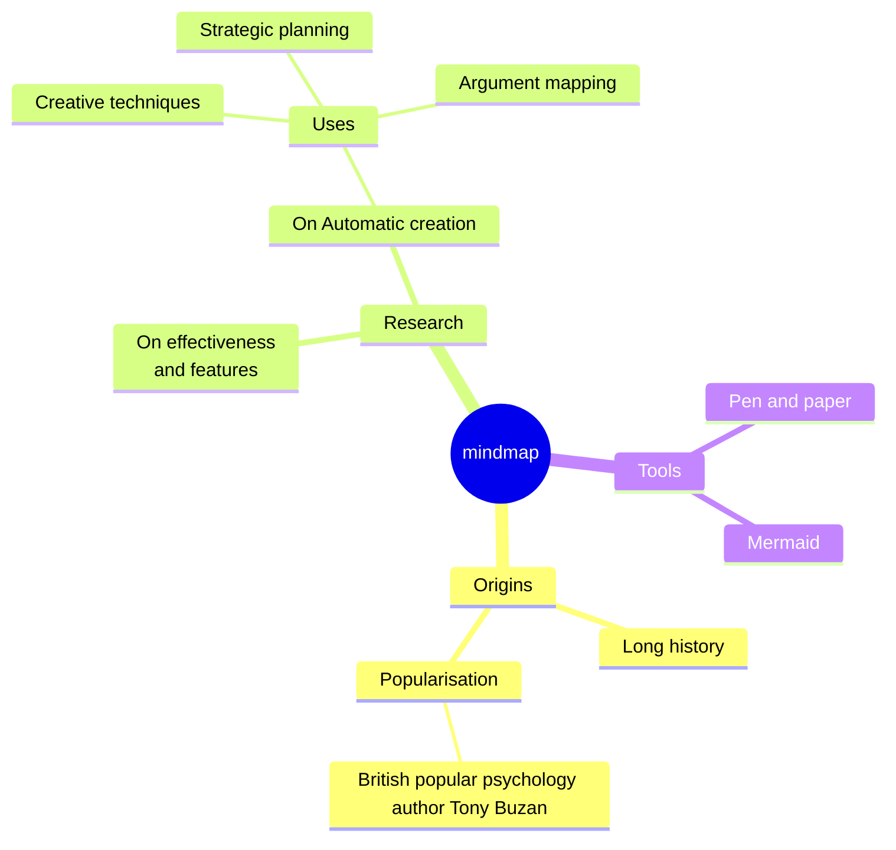
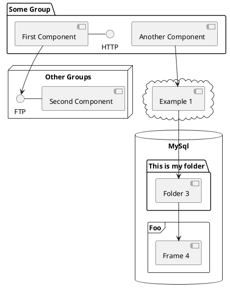

<div class="subtitle">Shodo</div>

# This is your presentation title

---

```yaml
layout: full
```

# Navigation

Hover on the bottom-left corner to see the navigation's controls panel

## Keyboard Shortcuts

|                                                      |                             |
| ---------------------------------------------------- | --------------------------- |
| <kbd>space</kbd> / <kbd>tab</kbd> / <kbd>right</kbd> | next animation or slide     |
| <kbd>left</kbd> / <kbd>shift</kbd><kbd>space</kbd>   | previous animation or slide |
| <kbd>up</kbd>                                        | previous slide              |
| <kbd>down</kbd>                                      | next slide                  |

<br/>

## Learn More

[Documentation](https://sli.dev) / [GitHub Repo](https://github.com/slidevjs/slidev)

---

```yaml
layout: intro
```

**I am Jaden Smith**

I am here because I love to give presentations.

You can find me at @username

---

```yaml
layout: section
index: 1
```

## Transition headline

Let’s start with the first set of slides

---

```yaml
layout: quote
```

Quotations are commonly printed as a means of inspiration and to invoke philosophical thoughts from the reader.

Some author

---

```yaml
layout: default
```

### This is a slide title

- Here you have a list of items
- And some text
- But remember not to overload your slides with content

Your audience will listen to you or read the content, but won’t do both.

---

```yaml
layout: statement
```

### Big concept

Bring the attention of your audience over a key concept using icons or illustrations

---

```yaml
layout: two-cols-header
```

### You can also split your content

::left::

#### White

Is the color of milk and fresh snow, the color produced by the combination of all the colors of the visible spectrum.

::right::

#### Black

Is the color of ebony and of outer space. It has been the symbolic color of elegance, solemnity and authority.

---

```yaml
layout: three-cols-header
```

### In two or three columns

::left::

#### Yellow

Is the color of gold, butter and ripe lemons. In the spectrum of visible light, yellow is found between green and orange.

::center::

#### Blue

Is the colour of the clear sky and the deep sea. It is located between violet and green on the optical spectrum.

::right::

#### Red

Is the color of blood, and because of this it has historically been associated with sacrifice, danger and courage.

---

```yaml
layout: image-right
image: /image-illustration-manifeste.png
```

### A picture is worth a thousand words

A complex idea can be conveyed with just a single still image, namely making it possible to absorb large amounts of data quickly.

---

# Some code is worth 1000 words

Use code snippets and get the highlighting directly, and even types hover![^1]

```ts {all|5|7|7-8|10|all} twoslash
// TwoSlash enables TypeScript hover information
// and errors in markdown code blocks
// More at https://shiki.style/packages/twoslash

import { computed, ref } from "vue";

const count = ref(0);
const doubled = computed(() => count.value * 2);

doubled.value = 2;
```

<arrow v-click="[4, 5]" x1="350" y1="310" x2="195" y2="334" color="#953" width="2" arrowSize="1" />

---

```yaml
level: 2
```

# Shiki Magic Move

Powered by [shiki-magic-move](https://shiki-magic-move.netlify.app/), Slidev supports animations across multiple code snippets.

Add multiple code blocks and wrap them with <code>````md magic-move</code> (four backticks) to enable the magic move. For example:

````md magic-move
```ts {*|2|*}
// step 1
const author = reactive({
  name: "John Doe",
  books: [
    "Vue 2 - Advanced Guide",
    "Vue 3 - Basic Guide",
    "Vue 4 - The Mystery",
  ],
});
```

```ts {*|1-2|3-4|3-4,8}
// step 2
export default {
  data() {
    return {
      author: {
        name: "John Doe",
        books: [
          "Vue 2 - Advanced Guide",
          "Vue 3 - Basic Guide",
          "Vue 4 - The Mystery",
        ],
      },
    };
  },
};
```

```ts
// step 3
export default {
  data: () => ({
    author: {
      name: "John Doe",
      books: [
        "Vue 2 - Advanced Guide",
        "Vue 3 - Basic Guide",
        "Vue 4 - The Mystery",
      ],
    },
  }),
};
```

Non-code blocks are ignored.

```vue
<!-- step 4 -->
<script setup>
const author = {
  name: "John Doe",
  books: [
    "Vue 2 - Advanced Guide",
    "Vue 3 - Basic Guide",
    "Vue 4 - The Mystery",
  ],
};
</script>
```
````

---

#### Live code edition using {monaco}

```ts {monaco}
function distance(x: number, y: number) {
  return Math.sqrt(x ** 2 + y ** 2);
}
```

<br/>

#### Execute code using {monaco-run}

```ts {monaco-run}
function distance(x: number, y: number) {
  return Math.sqrt(x ** 2 + y ** 2);
}
console.log(distance(3, 4));
```

---

# Diffs can be reviewed

{monaco-diff} can generate a diff between two code blocks!

<!-- prettier-ignore -->
```ts {monaco-diff}
console.log('Original text')
~~~
console.log('Modified text')
```

---

```yaml
layout: image
image: /image-illustration-manifeste.png
```

Want big impact?
**Use big image.**

---

### Use tables to compare data

|        | A   | B   | C   |
| ------ | --- | --- | --- |
| Yellow | 10  | 20  | 7   |
| Blue   | 20  | 15  | 10  |
| Orange | 30  | 24  | 16  |

---

```yaml
layout: center
```

<strong>89,526,124</strong>

Whoa! That’s a big number, aren’t you proud?

---

```yaml
layout: three-rows
```

::top::
<strong>89,526,124$</strong>

That’s a lot of money

::center::
<strong>185,244 users</strong>

And a lot of users

::bottom::
<strong>100%</strong>

Total success!

---

```yaml
layout: six-cells-header
```

### Let’s review some concepts

::top-left::

#### Top left

This shows on the top left

::top-center::

#### Top center

This shows on the top center

::top-right::

#### Top right

This shows on the top right

::bottom-left::

#### Bottom left

This shows on the bottom left

::bottom-center::

#### Bottom center

This shows on the bottom center

::bottom-right::

#### Bottom right

This shows on the bottom right

---

## Components

<div grid="~ cols-2 gap-4">
<div>

You can use Vue components directly inside your slides.

We have provided a few built-in components like `<Tweet/>` that you can use directly.

And adding your custom components is also super easy.

```html
<Counter :count="10" />
```

<!-- ./components/Counter.vue -->
<Counter :count="10" m="t-4" />

Check out [the guides](https://sli.dev/builtin/components.html) for more.

</div>
<div>

```html
<Tweet id="1225079443758206976" />
```

<Tweet id="1225079443758206976" scale="0.65" />

</div>
</div>

<!--
Presenter note with **bold**, *italic*, and ~~striked~~ text.

Also, HTML elements are valid:
<div class="flex w-full">
  <span style="flex-grow: 1;">Left content</span>
  <span>Right content</span>
</div>
-->

---

```yaml
layout: full
```

## Videos

<br />

```html
<Youtube id="56EpJFCka1I" width="80%" height="350px" />
```

<br />

<Youtube id="56EpJFCka1I" width="80%" height="350px" />

---

# Clicks Animations

You can add `v-click` to elements to add a click animation.

<div v-click>

This shows up when you click the slide:

```html
<div v-click>This shows up when you click the slide.</div>
```

</div>

<br>

<v-click>

The <span v-mark.red="3"><code>v-mark</code> directive</span>
also allows you to add
<span v-mark.circle.orange="4">inline marks</span>
, powered by [Rough Notation](https://roughnotation.com/):

```html
<span v-mark.underline.orange>inline markers</span>
```

</v-click>

<div mt-20 v-click>

[Learn More](https://sli.dev/guide/animations#click-animations)

</div>

---

# Motions

Motion animations are powered by [@vueuse/motion](https://motion.vueuse.org/), triggered by `v-motion` directive.

```html
<div
  v-motion
  :initial="{ x: -80 }"
  :enter="{ x: 0 }"
  :click-3="{ x: 80 }"
  :leave="{ x: 1000 }"
>
  Slidev
</div>
```

<div class="w-60 relative">
  <div class="relative w-40 h-40">
    
    
    
  </div>

  <div
    class="text-5xl absolute top-14 left-40 text-[#2B90B6] -z-1"
    v-motion
    :initial="{ x: -80, opacity: 0}"
    :enter="{ x: 0, opacity: 1, transition: { delay: 2000, duration: 1000 } }">
    Slidev
  </div>
</div>

<!-- vue script setup scripts can be directly used in markdown, and will only affects current page -->
<script setup lang="ts">
const final = {
  x: 0,
  y: 0,
  rotate: 0,
  scale: 1,
  transition: {
    type: 'spring',
    damping: 10,
    stiffness: 20,
    mass: 2
  }
}
</script>

<div
  v-motion
  :initial="{ x:35, y: 30, opacity: 0}"
  :enter="{ y: 0, opacity: 1, transition: { delay: 3500 } }">

[Learn More](https://sli.dev/guide/animations.html#motion)

</div>

---

# LaTeX

LaTeX is supported out-of-box powered by [KaTeX](https://katex.org/).

<br>

Inline $\sqrt{3x-1}+(1+x)^2$

Block

$$
{1|3|all}
\begin{array}{c}

\nabla \times \vec{\mathbf{B}} -\, \frac1c\, \frac{\partial\vec{\mathbf{E}}}{\partial t} &
= \frac{4\pi}{c}\vec{\mathbf{j}}    \nabla \cdot \vec{\mathbf{E}} & = 4 \pi \rho \\

\nabla \times \vec{\mathbf{E}}\, +\, \frac1c\, \frac{\partial\vec{\mathbf{B}}}{\partial t} & = \vec{\mathbf{0}} \\

\nabla \cdot \vec{\mathbf{B}} & = 0

\end{array}
$$

<br>

[Learn more](https://sli.dev/guide/syntax#latex)

---

# Diagrams

You can create diagrams / graphs from textual descriptions, directly in your Markdown.

<div class="grid grid-cols-4 gap-5 pt-4 -mb-6">









</div>

[Learn More](https://sli.dev/guide/syntax.html#diagrams)

---

```yaml
layout: screenshot
layoutClass: laptop
screenshot: image-illustration-manifeste.png
```

::left::

## Screenshot display

::right::

Show and explain your web, app or software projects using these gadget templates.

---

```yaml
layout: screenshot
layoutClass: mobile
screenshot: shodo.io-screenshot.png
```

::left::

## Screenshot display

::right::

Show and explain your web, app or software projects using these gadget templates.

---

```yaml
layout: end
```

**Any questions?**

You can find me at

- @username
- user@mail.me
